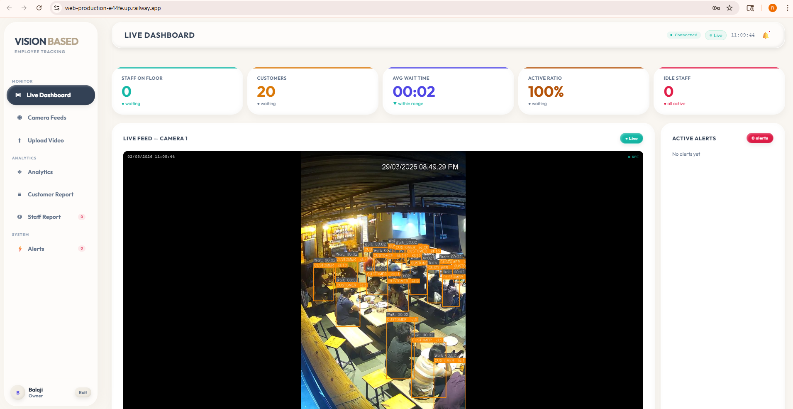
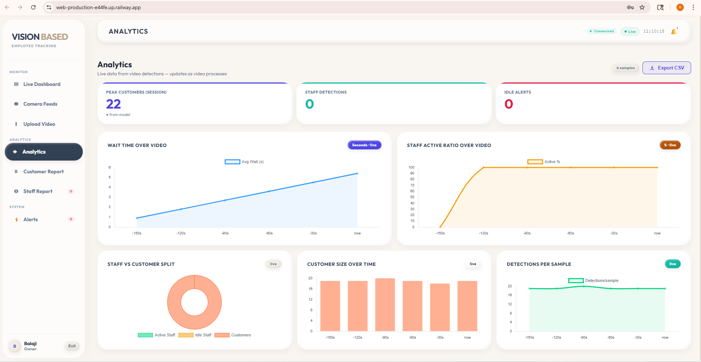
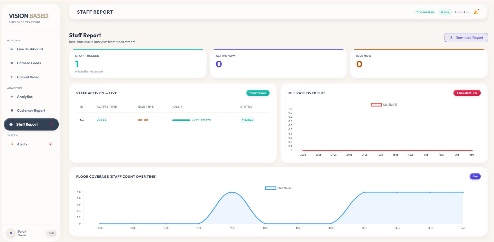
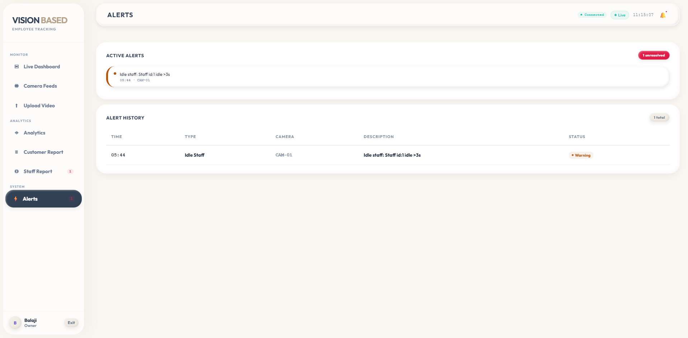
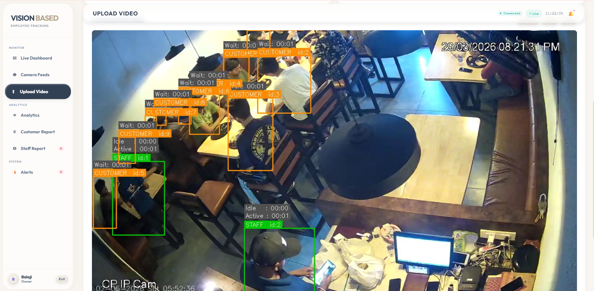

# Vision Based Employee Tracking Under Indoor Environments

Real-time Staff & Customer tracking system using YOLOv8, deployed on AWS EC2.


## 🔍 Overview
A production-grade real-time video analytics system that tracks Staff and Customer behavior from indoor camera feeds. Built with a custom-trained YOLOv8 model and a custom multi-class StableTracker, served via a live Flask + Socket.IO web dashboard.

## ✨ Features
- 🎯 Real-time Staff/Customer detection using custom YOLOv8 (95.34% mAP@0.5)
- 🧠 Custom StableTracker with graveyard-based re-identification and IoU+centroid matching
- ⏱️ Per-track idle/active time accumulation with breach alerts
- 📊 Live KPI dashboard — staff count, idle count, queue size, avg wait time
- 📤 CSV export for analytics
- ☁️ Deployed on AWS EC2

## 🛠️ Tech Stack
| Component | Technology |
|-----------|-----------|
| Detection | YOLOv8 (Ultralytics) |
| Tracking | Custom StableTracker + ByteTrack |
| Backend | Python, Flask, Flask-SocketIO |
| Frontend | HTML, CSS, JavaScript, Chart.js |
| Deployment | AWS EC2 (Amazon Linux) |
| Dataset | ~300–400 images via Roboflow |

## 📊 Model Performance
| Metric | Value |
|--------|-------|
| mAP@0.5 | 95.34% |
| F1 Score | 92.63% |
| Precision | 93.05% |
| Recall | 92.21% |
| Training Epochs | 50 |
| Training Time | ~2.38 hours |

## 🚀 Installation

```bash
git clone https://github.com/balaji2345/employee-tracking-in-indoor-environments.git
cd employee-tracking-in-indoor-environments
pip install -r requirements.txt
python app.py
```

## 📁 Project Structure
├── app.py                  # Main Flask application
├── templates/              # Frontend dashboard HTML
├── runs/                   # YOLOv8 trained weights
├── requirements.txt        # Dependencies
├── Dockerfile              # Docker support
└── training.py             # Model training script

## 📸 Screenshots

## 📸 Screenshots







## 🌐 Live Demo
👉 [Click here to open the app](http://employee-tracking-indoor.duckdns.org:5000)

> Upload any workplace/retail video and see real-time Staff & Customer tracking in action!

## 🎥 Demo Video
Download and test with this sample video:
👉 [Download demo video](demo/video1.mp4)

**How to use:**
1. Open the live app link above
2. Download the demo video
3. Upload it in the app
4. See real-time Staff & Customer tracking!


## 🌐 Live Demo
Deployed on AWS EC2 — validated with real-world operational data by client.

## 📬 Contact
**Kaggola Reddy Balaji**
- Email: reddybalaji1436@gmail.com
- LinkedIn: [reddy-balaji-kaggola](https://www.linkedin.com/in/reddy-balaji-kaggola-a5651824a/)
- GitHub: [balaji2345](https://github.com/balaji2345)
